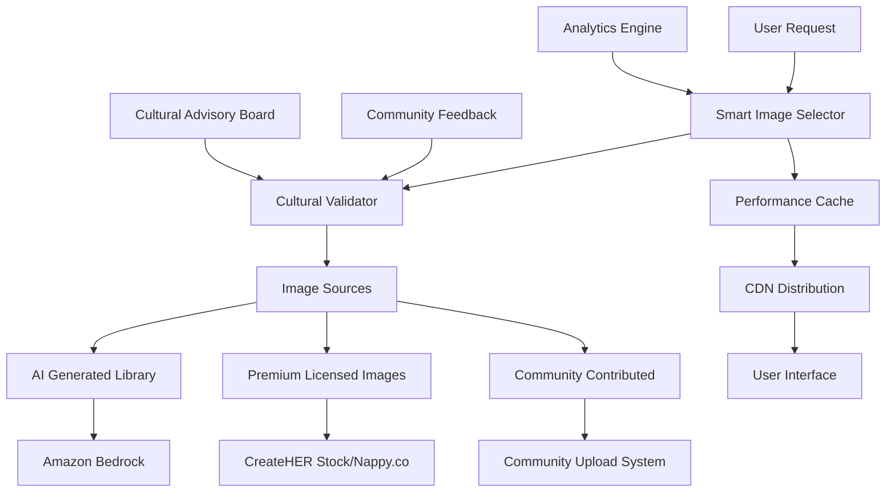

# Design Document - Authentic Black Women Image Integration

## Overview

This design document outlines a comprehensive solution for implementing culturally appropriate, authentic imagery of Black women throughout the AIme wellness platform. The solution addresses immediate needs while building a sustainable, community-driven image ecosystem.

## Architecture

### High-Level System Architecture



### Core Components

#### 1. AI Image Generation Service
**Purpose**: Generate custom, culturally appropriate imagery using Amazon Bedrock
**Technology**: Amazon Bedrock + Stable Diffusion XL
**Output**: 200+ high-quality images of Black women in various contexts

#### 2. Cultural Validation Pipeline
**Purpose**: Ensure all imagery meets cultural appropriateness standards
**Technology**: Amazon Rekognition + Custom ML models
**Features**: Demographic analysis, context validation, community feedback integration

#### 3. Smart Image Selection Engine
**Purpose**: Dynamically select the most appropriate image for each context
**Technology**: Custom algorithm with ML-based optimization
**Features**: Context matching, rotation logic, personalization, performance tracking

#### 4. Community Feedback System
**Purpose**: Enable community input on image appropriateness
**Technology**: Real-time feedback collection with sentiment analysis
**Features**: Rating system, reporting mechanism, community moderation

## Components and Interfaces

### Image Generation Service Interface

```typescript
interface ImageGenerationService {
  // Generate images by category
  generateWellnessImages(count: number, specifications: WellnessImageSpec): Promise<GeneratedImage[]>
  generateCommunityImages(count: number, specifications: CommunityImageSpec): Promise<GeneratedImage[]>
  generateEmpowermentImages(count: number, specifications: EmpowermentImageSpec): Promise<GeneratedImage[]>
  generateJoyHealingImages(count: number, specifications: JoyHealingImageSpec): Promise<GeneratedImage[]>
  
  // Validation and quality control
  validateImageQuality(image: GeneratedImage): Promise<QualityScore>
  regenerateIfNeeded(image: GeneratedImage, feedback: ValidationFeedback): Promise<GeneratedImage>
  
  // Batch operations
  generateBatchByPrompts(prompts: ImagePrompt[]): Promise<GeneratedImage[]>
  optimizeForPerformance(images: GeneratedImage[]): Promise<OptimizedImage[]>
}

interface WellnessImageSpec {
  ageRange: AgeRange
  skinToneVariety: SkinTone[]
  activities: WellnessActivity[]
  settings: WellnessSetting[]
  emotions: EmotionalTone[]
  bodyTypes: BodyType[]
}

interface GeneratedImage {
  id: string
  url: string
  category: ImageCategory
  specifications: ImageSpec
  qualityScore: number
  culturalScore: number
  metadata: ImageMetadata
  generationPrompt: string
  createdAt: Date
}
```

### Cultural Validation Interface

```typescript
interface CulturalValidator {
  // Primary validation methods
  validateDemographics(image: Image): Promise<DemographicValidation>
  validateContextualAppropriateness(image: Image, context: UsageContext): Promise<ContextValidation>
  validateCulturalSensitivity(image: Image): Promise<CulturalValidation>
  
  // Community integration
  processCommunityFeedback(imageId: string, feedback: CommunityFeedback): Promise<ValidationUpdate>
  getCommunityConsensus(imageId: string): Promise<CommunityConsensus>
  
  // Advisory board integration
  submitForAdvisoryReview(image: Image): Promise<AdvisoryReviewRequest>
  processAdvisoryFeedback(reviewId: string, feedback: AdvisoryFeedback): Promise<ValidationUpdate>
  
  // Continuous improvement
  updateValidationCriteria(newCriteria: ValidationCriteria): Promise<void>
  analyzeValidationTrends(): Promise<ValidationTrends>
}

interface DemographicValidation {
  isBlackWoman: boolean
  confidence: number
  ageEstimate: AgeRange
  skinToneAnalysis: SkinToneAnalysis
  bodyTypeInclusion: BodyTypeInclusion
  appropriatenessScore: number
}

interface CulturalValidation {
  respectfulRepresentation: boolean
  empoweringContext: boolean
  avoidsSterotypes: boolean
  culturallyRelevant: boolean
  communityApproved: boolean
  overallScore: number
  recommendations: string[]
}
```

### Smart Image Selection Interface

```typescript
interface SmartImageSelector {
  // Context-based selection
  selectForWellnessContext(context: WellnessContext): Promise<SelectedImage>
  selectForCommunityContext(context: CommunityContext): Promise<SelectedImage>
  selectForEmpowermentContext(context: EmpowermentContext): Promise<SelectedImage>
  
  // Rotation and variety
  rotateImagesForPage(pageId: string, userId?: string): Promise<SelectedImage[]>
  ensureVariety(selections: SelectedImage[]): Promise<SelectedImage[]>
  
  // Personalization
  personalizeForUser(userId: string, context: UsageContext): Promise<SelectedImage>
  learnFromUserEngagement(userId: string, imageId: string, engagement: EngagementData): Promise<void>
  
  // Performance optimization
  preloadForContext(context: UsageContext): Promise<void>
  cacheOptimalSelections(): Promise<void>
}

interface SelectedImage {
  image: Image
  selectionReason: SelectionReason
  contextMatch: number
  expectedEngagement: number
  fallbackOptions: Image[]
  cacheKey: string
}

interface WellnessContext {
  pageType: 'meditation' | 'exercise' | 'nutrition' | 'mental-health' | 'community-support'
  userJourney: 'discovery' | 'engagement' | 'progress' | 'celebration'
  emotionalTone: 'calming' | 'energizing' | 'supportive' | 'empowering'
  timeOfDay?: 'morning' | 'afternoon' | 'evening'
}
```

### Community Feedback Interface

```typescript
interface CommunityFeedbackSystem {
  // Feedback collection
  collectImageFeedback(imageId: string, userId: string, feedback: ImageFeedback): Promise<void>
  reportInappropriateImage(imageId: string, userId: string, reason: ReportReason): Promise<ReportId>
  
  // Community moderation
  enableCommunityModeration(imageId: string): Promise<ModerationSession>
  processModerationVotes(sessionId: string): Promise<ModerationResult>
  
  // Feedback analysis
  analyzeFeedbackTrends(): Promise<FeedbackTrends>
  identifyProblematicImages(): Promise<ProblematicImage[]>
  
  // Community advisory integration
  submitToAdvisoryBoard(imageId: string, communityFeedback: CommunityFeedback): Promise<AdvisorySubmission>
  processAdvisoryDecision(submissionId: string, decision: AdvisoryDecision): Promise<void>
}

interface ImageFeedback {
  appropriateness: 1 | 2 | 3 | 4 | 5
  culturalSensitivity: 1 | 2 | 3 | 4 | 5
  empowerment: 1 | 2 | 3 | 4 | 5
  authenticity: 1 | 2 | 3 | 4 | 5
  comments?: string
  suggestedImprovements?: string[]
}

interface ReportReason {
  category: 'inappropriate-demographics' | 'cultural-insensitivity' | 'stereotypical' | 'low-quality' | 'other'
  description: string
  severity: 'low' | 'medium' | 'high' | 'critical'
}
```

## Data Models

### Image Data Model

```typescript
interface Image {
  id: string
  url: string
  thumbnailUrl: string
  category: ImageCategory
  subcategory: string
  source: ImageSource
  
  // Metadata
  title: string
  altText: string
  description: string
  tags: string[]
  
  // Cultural validation
  culturalScore: number
  demographicValidation: DemographicValidation
  contextValidation: ContextValidation
  communityScore: number
  
  // Performance
  dimensions: ImageDimensions
  fileSize: number
  format: 'webp' | 'jpg' | 'png'
  optimizedVersions: OptimizedVersion[]
  
  // Usage tracking
  usageCount: number
  engagementScore: number
  lastUsed: Date
  
  // Lifecycle
  status: 'active' | 'under-review' | 'flagged' | 'retired'
  createdAt: Date
  updatedAt: Date
  reviewedAt?: Date
  reviewedBy?: string
}

enum ImageCategory {
  WELLNESS = 'wellness',
  COMMUNITY = 'community', 
  EMPOWERMENT = 'empowerment',
  JOY_HEALING = 'joy-healing',
  PORTRAITS = 'portraits',
  LIFESTYLE = 'lifestyle'
}

enum ImageSource {
  AI_GENERATED = 'ai-generated',
  PREMIUM_LICENSED = 'premium-licensed',
  COMMUNITY_CONTRIBUTED = 'community-contributed',
  CUSTOM_COMMISSIONED = 'custom-commissioned'
}
```

### Cultural Advisory Board Model

```typescript
interface CulturalAdvisoryBoard {
  id: string
  members: AdvisoryMember[]
  reviewQueue: AdvisoryReview[]
  guidelines: CulturalGuidelines
  decisions: AdvisoryDecision[]
}

interface AdvisoryMember {
  id: string
  name: string
  expertise: string[]
  communityRole: string
  joinDate: Date
  reviewCount: number
}

interface AdvisoryReview {
  id: string
  imageId: string
  submittedBy: string
  submissionReason: string
  communityFeedback: CommunityFeedback
  assignedReviewers: string[]
  status: 'pending' | 'in-review' | 'completed'
  deadline: Date
}

interface CulturalGuidelines {
  representationStandards: RepresentationStandard[]
  contextualRequirements: ContextualRequirement[]
  prohibitedElements: ProhibitedElement[]
  empowermentCriteria: EmpowermentCriterion[]
  lastUpdated: Date
}
```

## Error Handling

### Image Generation Errors
- **Generation Failure**: Retry with modified prompts, fallback to curated images
- **Quality Issues**: Automatic regeneration with improved specifications
- **Cultural Validation Failure**: Immediate rejection and regeneration
- **Performance Issues**: Graceful degradation to cached alternatives

### Community Feedback Errors
- **Inappropriate Reports**: Community moderation and advisory review
- **System Abuse**: Rate limiting and user verification
- **Consensus Conflicts**: Advisory board escalation
- **Technical Failures**: Backup feedback collection methods

### Selection Engine Errors
- **No Appropriate Images**: Fallback to placeholder with explanation
- **Performance Degradation**: Cache warming and preloading
- **Context Mismatch**: Broader category selection with user notification
- **Personalization Failures**: Default to community-validated selections

## Testing Strategy

### Cultural Validation Testing
1. **Demographic Accuracy Testing**: Verify AI correctly identifies Black women
2. **Cultural Sensitivity Testing**: Community review of generated content
3. **Context Appropriateness Testing**: Validate image-context matching
4. **Bias Detection Testing**: Identify and eliminate algorithmic bias

### Performance Testing
1. **Load Testing**: High-traffic image selection and delivery
2. **Generation Speed Testing**: AI image creation performance
3. **Cache Efficiency Testing**: CDN and local cache performance
4. **Mobile Performance Testing**: Responsive image delivery

### Community Integration Testing
1. **Feedback System Testing**: Community input collection and processing
2. **Moderation Testing**: Community-driven content moderation
3. **Advisory Board Testing**: Expert review process validation
4. **Escalation Testing**: Emergency response procedures

### Accessibility Testing
1. **Alt Text Quality**: Descriptive and respectful image descriptions
2. **Screen Reader Compatibility**: Full accessibility compliance
3. **Color Contrast**: Ensure visibility for all users
4. **Keyboard Navigation**: Full keyboard accessibility

## Security Considerations

### Image Content Security
- **Content Validation**: Multi-layer validation before publication
- **Source Verification**: Authenticated image sources and licensing
- **Malicious Content Detection**: Automated scanning for inappropriate content
- **Community Reporting**: Rapid response to community concerns

### Data Privacy
- **User Feedback Privacy**: Anonymous feedback collection options
- **Engagement Tracking**: Privacy-compliant analytics
- **Community Moderation**: Transparent and fair moderation processes
- **Advisory Board Privacy**: Confidential review processes

### System Security
- **API Security**: Authenticated access to generation and selection services
- **Cache Security**: Secure image storage and delivery
- **Audit Logging**: Comprehensive logging of all image operations
- **Emergency Procedures**: Rapid response to security incidents

This design provides a comprehensive, culturally sensitive, and technically robust solution for authentic Black women representation throughout the AIme platform.