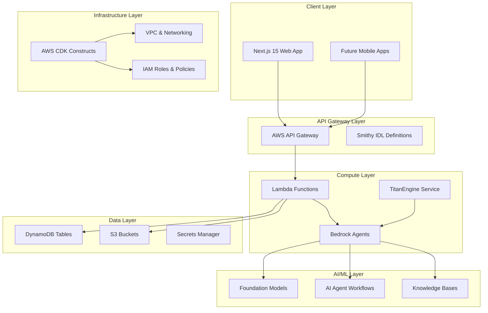
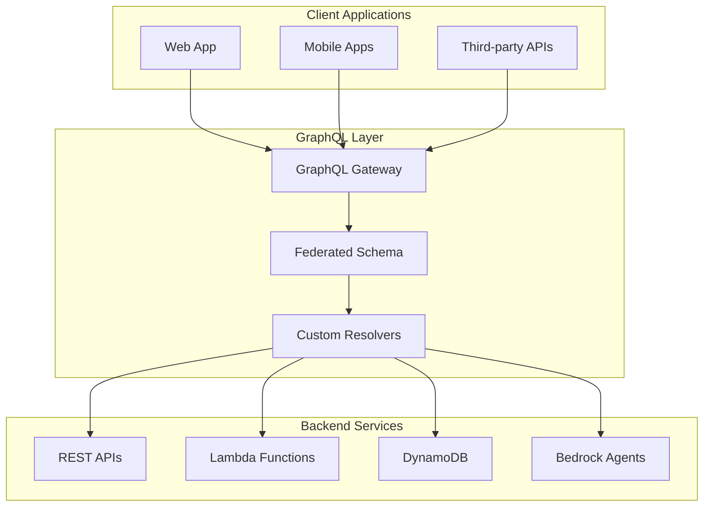

# Design Document

## Overview

The AWS PDK Enterprise Migration transforms the MADMall social wellness platform from a traditional React/Express architecture into a modern, scalable, enterprise-grade system. This migration leverages AWS Project Development Kit (PDK) to create a type-safe, contract-first monorepo that integrates cutting-edge AWS services including Bedrock AI agents, Lambda serverless functions, and comprehensive infrastructure as code.

The design prioritizes maintainability, scalability, security, and developer experience while preserving all existing functionality. The new architecture supports rapid feature development, automated deployments, and enterprise compliance requirements.

## Architecture

### High-Level Architecture



### Monorepo Structure

```
/packages
├── /shared-types          # Cross-service TypeScript definitions
│   ├── /api              # API request/response types
│   ├── /domain           # Business domain models
│   └── /events           # Event schemas
├── /web-app              # Next.js 15 application
│   ├── /app              # App Router pages
│   ├── /components       # React components
│   ├── /lib              # Client utilities
│   └── /styles           # CSS modules & themes
├── /api-gateway          # Smithy IDL API definitions
│   ├── /models           # Data models
│   ├── /services         # Service definitions
│   └── /operations       # API operations
├── /bedrock-agents       # AI agent workflows
│   ├── /agents           # Agent definitions
│   ├── /workflows        # Business logic workflows
│   └── /knowledge-bases  # Knowledge base configurations
├── /titanengine          # Migrated image service
│   ├── /providers        # Image provider integrations
│   ├── /services         # Core image services
│   └── /agents           # Bedrock agent integrations
├── /infrastructure       # CDK constructs
│   ├── /constructs       # Reusable CDK constructs
│   ├── /stacks           # Application stacks
│   └── /environments     # Environment configurations
└── /docs                 # Auto-generated documentation
    ├── /api              # API documentation
    ├── /architecture     # Architecture diagrams
    └── /deployment       # Deployment guides
```

## Components and Interfaces

### 1. Shared Types Package

**Purpose:** Centralized TypeScript definitions for type safety across all packages.

**Key Components:**
- **Domain Models:** User, Circle, Story, Business, Resource entities
- **API Contracts:** Request/response schemas matching Smithy definitions
- **Event Schemas:** Inter-service communication event types
- **Configuration Types:** Environment and feature flag definitions

**Interfaces:**
```typescript
// Domain Models
export interface User {
  id: string;
  email: string;
  profile: UserProfile;
  preferences: UserPreferences;
  createdAt: Date;
  updatedAt: Date;
}

export interface Circle {
  id: string;
  name: string;
  description: string;
  type: CircleType;
  members: CircleMember[];
  settings: CircleSettings;
}

// API Contracts
export interface CreateUserRequest {
  email: string;
  profile: Partial<UserProfile>;
}

export interface CreateUserResponse {
  user: User;
  token: AuthToken;
}
```

### 2. Web Application Package

**Purpose:** Next.js 15 application with App Router, server-side rendering, and optimized performance.

**Key Components:**
- **App Router Pages:** File-based routing with layout components
- **Server Components:** SSR-optimized components for initial page loads
- **Client Components:** Interactive components with state management
- **API Routes:** Next.js API routes for client-side data fetching
- **Middleware:** Authentication, logging, and request processing

**Architecture Patterns:**
- **Server-Side Rendering:** Initial page loads with hydrated interactivity
- **Component Composition:** Reusable components with proper prop interfaces
- **State Management:** React Context for global state, local state for components
- **Error Boundaries:** Graceful error handling with fallback UI

### 3. API Gateway Package

**Purpose:** Contract-first API development using Smithy IDL with automatic code generation.

**Key Components:**
- **Service Definitions:** Smithy service specifications
- **Operation Models:** Request/response shapes and validation rules
- **Error Models:** Standardized error response structures
- **Code Generation:** TypeScript clients and Lambda handlers

**Smithy Service Example:**
```smithy
$version: "2"
namespace com.madmall.api

service UserService {
    version: "1.0"
    operations: [CreateUser, GetUser, UpdateUser, DeleteUser]
}

@http(method: "POST", uri: "/users")
operation CreateUser {
    input: CreateUserInput
    output: CreateUserOutput
    errors: [ValidationError, ConflictError]
}

structure CreateUserInput {
    @required
    email: String
    
    profile: UserProfile
}
```

### 4. Bedrock Agents Package

**Purpose:** AI-powered business logic using AWS Bedrock agents and foundation models.

**Key Components:**
- **Cultural Validation Agent:** Ensures content cultural appropriateness
- **Content Moderation Agent:** Automated content safety and compliance
- **Recommendation Agent:** Personalized content and connection recommendations
- **Wellness Coach Agent:** AI-powered wellness guidance and support

**Agent Workflow Example:**
```typescript
export interface CulturalValidationWorkflow {
  validateContent(content: string, culturalContext: CulturalContext): Promise<ValidationResult>;
  suggestImprovements(content: string, issues: ValidationIssue[]): Promise<string[]>;
  generateCulturallyAppropriateAlternatives(content: string): Promise<string[]>;
}
```

### 5. TitanEngine Package

**Purpose:** Enhanced image service with Bedrock integration and existing provider support.

**Key Components:**
- **Provider Abstraction:** Unified interface for multiple image sources
- **Bedrock Integration:** AI-powered image generation and analysis
- **Cultural Validation:** Automated cultural appropriateness checking
- **Caching Layer:** Optimized image delivery and storage

**Enhanced Architecture:**
```typescript
export interface EnhancedImageService {
  // Existing functionality
  searchImages(query: string, provider: ImageProvider): Promise<ImageResult[]>;
  
  // New Bedrock-powered features
  generateCulturallyAppropriateImage(prompt: string, context: CulturalContext): Promise<GeneratedImage>;
  analyzeImageCulturalRelevance(imageUrl: string): Promise<CulturalAnalysis>;
  suggestImageImprovements(imageUrl: string, targetAudience: Audience): Promise<Suggestion[]>;
}
```

### 6. Infrastructure Package

**Purpose:** Comprehensive AWS infrastructure as code using CDK constructs.

**Key Constructs:**
- **Application Stack:** Main application resources and networking
- **Database Stack:** DynamoDB tables with proper indexing and backup
- **Security Stack:** IAM roles, Cognito, WAF, and encryption
- **Monitoring Stack:** CloudWatch dashboards, alarms, and X-Ray tracing

## Data Models

### Core Entities

**User Entity:**
```typescript
interface User {
  PK: string;           // USER#${userId}
  SK: string;           // PROFILE
  GSI1PK: string;       // EMAIL#${email}
  GSI1SK: string;       // USER#${userId}
  
  userId: string;
  email: string;
  profile: {
    firstName: string;
    lastName: string;
    bio?: string;
    culturalBackground: string[];
    communicationStyle: CommunicationStyle;
    diagnosisStage: DiagnosisStage;
    supportNeeds: SupportNeed[];
  };
  preferences: UserPreferences;
  createdAt: string;
  updatedAt: string;
  version: number;
}
```

**Circle Entity:**
```typescript
interface Circle {
  PK: string;           // CIRCLE#${circleId}
  SK: string;           // METADATA
  GSI1PK: string;       // CIRCLE_TYPE#${type}
  GSI1SK: string;       // CREATED#${createdAt}
  
  circleId: string;
  name: string;
  description: string;
  type: CircleType;
  settings: {
    isPrivate: boolean;
    requireApproval: boolean;
    maxMembers?: number;
    culturalFocus?: string[];
  };
  moderators: string[];
  createdBy: string;
  createdAt: string;
  updatedAt: string;
}
```

### DynamoDB Table Design

**Single Table Design:**
- **Primary Key:** Partition Key (PK) + Sort Key (SK)
- **GSI1:** Global Secondary Index for alternate access patterns
- **GSI2:** Additional index for complex queries
- **TTL:** Time-to-live for temporary data (sessions, tokens)

**Access Patterns:**
1. Get user by ID: `PK = USER#${userId}, SK = PROFILE`
2. Get user by email: `GSI1PK = EMAIL#${email}`
3. Get circles by type: `GSI1PK = CIRCLE_TYPE#${type}`
4. Get user's circles: `PK = USER#${userId}, SK begins_with CIRCLE#`

## Error Handling

### Standardized Error Response

```typescript
interface APIError {
  code: string;
  message: string;
  details?: Record<string, any>;
  timestamp: string;
  requestId: string;
  path: string;
}
```

### Error Categories

1. **Validation Errors (400):** Input validation failures
2. **Authentication Errors (401):** Invalid or missing authentication
3. **Authorization Errors (403):** Insufficient permissions
4. **Not Found Errors (404):** Resource not found
5. **Conflict Errors (409):** Resource conflicts or constraints
6. **Rate Limit Errors (429):** Request rate exceeded
7. **Server Errors (500):** Internal system failures

### Error Handling Strategy

- **Circuit Breaker Pattern:** Prevent cascade failures
- **Retry Logic:** Exponential backoff for transient failures
- **Dead Letter Queues:** Capture failed async operations
- **Structured Logging:** Comprehensive error context and tracing

## Testing Strategy

### Testing Pyramid

1. **Unit Tests (70%)**
   - Individual function and component testing
   - Mock external dependencies
   - Fast execution and high coverage

2. **Integration Tests (20%)**
   - API endpoint testing with real AWS services
   - Database integration testing
   - Cross-service communication testing

3. **End-to-End Tests (10%)**
   - Full user workflow testing
   - Browser automation with Playwright
   - Production-like environment testing

### Testing Tools and Frameworks

- **Unit Testing:** Jest, React Testing Library
- **Integration Testing:** Supertest, AWS SDK mocks
- **E2E Testing:** Playwright, Cypress
- **Load Testing:** Artillery, AWS Load Testing Solution
- **Security Testing:** OWASP ZAP, Snyk

### Continuous Testing

- **Pre-commit Hooks:** Lint, format, and basic tests
- **Pull Request Validation:** Full test suite execution
- **Deployment Testing:** Smoke tests and health checks
- **Production Monitoring:** Synthetic transaction monitoring

## Security Considerations

### Authentication and Authorization

- **AWS Cognito:** User authentication with MFA support
- **JWT Tokens:** Stateless authentication with proper expiration
- **RBAC:** Role-based access control with fine-grained permissions
- **API Keys:** Service-to-service authentication

### Data Protection

- **Encryption at Rest:** DynamoDB and S3 encryption with KMS
- **Encryption in Transit:** TLS 1.3 for all communications
- **Data Classification:** PII identification and protection
- **Data Retention:** Automated data lifecycle management

### Network Security

- **VPC Configuration:** Private subnets for sensitive resources
- **Security Groups:** Least privilege network access
- **WAF Rules:** Protection against common web attacks
- **DDoS Protection:** AWS Shield Advanced integration

### Compliance and Auditing

- **CloudTrail:** Comprehensive API call logging
- **Config Rules:** Automated compliance monitoring
- **GuardDuty:** Threat detection and security monitoring
- **Security Hub:** Centralized security findings management

## Performance Optimization

### Frontend Performance

- **Code Splitting:** Route-based and component-based splitting
- **Image Optimization:** Next.js Image component with WebP support
- **Caching Strategy:** Browser caching and CDN integration
- **Bundle Analysis:** Regular bundle size monitoring and optimization

### Backend Performance

- **Lambda Optimization:** Memory allocation and cold start reduction
- **Database Optimization:** Proper indexing and query patterns
- **Caching Layers:** ElastiCache for frequently accessed data
- **Connection Pooling:** Efficient database connection management

### Monitoring and Observability

- **CloudWatch Metrics:** Custom application metrics
- **X-Ray Tracing:** Distributed request tracing
- **Application Insights:** User experience monitoring
- **Performance Budgets:** Automated performance regression detection

## Cost Optimization

### AWS Cost Management

- **Cost Explorer Integration:** Automated cost analysis and reporting
- **Resource Tagging Strategy:** Comprehensive tagging for cost allocation
- **Reserved Instances:** Strategic RI purchasing for predictable workloads
- **Spot Instances:** Cost-effective compute for non-critical batch processing
- **Auto Scaling:** Dynamic resource scaling based on demand patterns
- **Lambda Optimization:** Memory and timeout optimization for cost efficiency

### Cost Monitoring and Alerts

```typescript
interface CostOptimizationConfig {
  budgetAlerts: {
    monthly: number;
    quarterly: number;
    anomalyDetection: boolean;
  };
  resourceOptimization: {
    unusedResourceDetection: boolean;
    rightsizingRecommendations: boolean;
    scheduledScaling: SchedulingRule[];
  };
}
```

## Multi-Tenancy Architecture

### Tenant Isolation Patterns

**Data Isolation Strategies:**
- **Tenant-per-Database:** Complete isolation for enterprise customers
- **Shared Database, Separate Schemas:** Balanced isolation and cost efficiency
- **Shared Tables with Tenant ID:** Cost-effective for smaller tenants
- **Hybrid Approach:** Different strategies based on tenant tier

**Tenant Management:**
```typescript
interface TenantConfiguration {
  tenantId: string;
  isolationLevel: 'database' | 'schema' | 'row';
  resourceLimits: {
    storage: number;
    apiCalls: number;
    users: number;
  };
  features: FeatureFlag[];
  customizations: TenantCustomization;
}
```

### B2B Expansion Considerations

- **White-label Solutions:** Customizable branding and domain configuration
- **Enterprise SSO:** SAML/OIDC integration for corporate authentication
- **Compliance Frameworks:** SOC 2, HIPAA, GDPR compliance per tenant
- **Custom Integrations:** Tenant-specific API integrations and webhooks

## Event Sourcing Architecture

### Event Store Design

**Event Schema:**
```typescript
interface DomainEvent {
  eventId: string;
  eventType: string;
  aggregateId: string;
  aggregateType: string;
  eventData: Record<string, any>;
  metadata: {
    userId: string;
    tenantId: string;
    timestamp: Date;
    version: number;
    correlationId: string;
  };
}
```

**Event Sourcing Benefits:**
- **Complete Audit Trail:** Full history of all system changes
- **Temporal Queries:** Query system state at any point in time
- **Event Replay:** Rebuild projections and handle system recovery
- **Eventual Consistency:** Distributed system consistency patterns

### CQRS Implementation

- **Command Side:** Write operations through event sourcing
- **Query Side:** Optimized read models and projections
- **Event Handlers:** Asynchronous event processing and side effects
- **Snapshots:** Performance optimization for large event streams

## GraphQL API Layer

### GraphQL Gateway Architecture



### GraphQL Schema Design

```graphql
type User {
  id: ID!
  email: String!
  profile: UserProfile!
  circles: [Circle!]!
  stories: [Story!]!
  preferences: UserPreferences!
}

type Circle {
  id: ID!
  name: String!
  description: String
  type: CircleType!
  members: [CircleMember!]!
  stories: [Story!]!
  isPrivate: Boolean!
}

type Query {
  user(id: ID!): User
  circle(id: ID!): Circle
  searchCircles(query: String!, filters: CircleFilters): [Circle!]!
  recommendedContent(userId: ID!): [Content!]!
}

type Mutation {
  createUser(input: CreateUserInput!): User!
  joinCircle(circleId: ID!): CircleMembership!
  shareStory(input: CreateStoryInput!): Story!
}

type Subscription {
  circleUpdates(circleId: ID!): CircleUpdate!
  newMessages(userId: ID!): Message!
}
```

### GraphQL Features

- **Schema Federation:** Distributed schema composition across services
- **Real-time Subscriptions:** WebSocket-based live updates
- **Caching Strategy:** Query-level caching with Redis
- **Rate Limiting:** Query complexity analysis and throttling
- **Authentication:** JWT-based authentication with field-level authorization