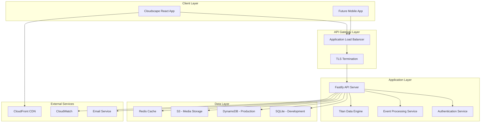

# Design Document

## Overview

The MADMall Social Wellness Hub is architected as a modern web application with a React frontend using Amazon Cloudscape Design System and a Node.js backend API. The system employs a microservices-inspired architecture with clear separation between the presentation layer, business logic, and data persistence. At its core, the **Titan Data Engine** represents a sophisticated artificial intelligence system that serves as the platform's analytical brain, employing advanced machine learning algorithms, multi-dimensional behavioral analysis, and rigorous ethical guardrails to transform user engagement patterns into actionable intelligence.

The Titan Engine's advanced predictive analytics capabilities extend beyond traditional recommendation systems, generating evidence-based Models of Care that bridge the gap between digital community insights and real-world healthcare delivery. Through comprehensive data synthesis and pattern recognition, the engine produces clinically-relevant recommendations that healthcare providers can integrate into their practice frameworks, creating a unprecedented feedback loop between patient community experiences and professional care protocols.

The design prioritizes cultural safety, therapeutic value, scalability, and data-driven decision making while maintaining strict privacy and security standards for a health-adjacent community platform.

## Architecture

### High-Level System Architecture



### Technology Stack

**Frontend:**
- React 18 with TypeScript
- Amazon Cloudscape Design System for UI components
- React Router for navigation
- Axios for API communication
- Vite for build tooling

**Backend:**
- Node.js 20 with Fastify framework
- TypeScript for type safety
- Drizzle ORM for database operations
- Zod for schema validation
- Pino for structured logging

**Data Storage:**
- SQLite for development environment
- DynamoDB for production (NoSQL for scalability)
- S3 for media file storage
- Redis for caching and session management

**Infrastructure:**
- AWS Application Load Balancer
- AWS CloudFront for CDN
- AWS CloudWatch for monitoring
- GitHub Actions for CI/CD

## Components and Interfaces

### Frontend Components

#### Core Layout Components
- **AppShell**: Main application wrapper with navigation and routing
- **Concourse**: Mall-like homepage with section navigation
- **NavigationBar**: Persistent navigation with user context
- **ErrorBoundary**: Global error handling with graceful fallbacks

#### Feature Components
- **PeerCircles**: Community discussion interface with real-time updates
- **ComedyLounge**: Video streaming interface with rating prompts
- **StoryBooth**: Audio/text content creation and sharing
- **Marketplace**: Product discovery with creator stories
- **ResourceHub**: Curated content library with search and filtering
- **UserProfile**: Account management and privacy controls

#### Shared Components
- **EventTracker**: Invisible component for user interaction logging
- **AccessibilityControls**: Text size, contrast, and screen reader support
- **ConsentManager**: Privacy consent collection and management
- **LoadingStates**: Consistent loading indicators across the app

### Backend Services

#### API Endpoints

**Authentication Service**
```typescript
POST /v1/auth/register
POST /v1/auth/login
POST /v1/auth/verify-email
POST /v1/auth/logout
GET /v1/auth/me
```

**User Management Service**
```typescript
GET /v1/users/profile
PUT /v1/users/profile
GET /v1/users/preferences
PUT /v1/users/preferences
DELETE /v1/users/account
```

**Community Service**
```typescript
GET /v1/circles
POST /v1/circles/{id}/join
GET /v1/circles/{id}/posts
POST /v1/circles/{id}/posts
PUT /v1/posts/{id}
DELETE /v1/posts/{id}
```

**Content Service**
```typescript
GET /v1/comedy/clips
GET /v1/resources
GET /v1/marketplace/shops
POST /v1/content/rate
POST /v1/content/save
```

**Analytics Service**
```typescript
POST /v1/events
GET /v1/recommendations
GET /v1/titan/insights
GET /v1/titan/next-features
```

#### Titan Data Engine: Advanced Predictive Analytics Architecture

The Titan Data Engine represents a state-of-the-art machine learning system designed specifically for healthcare-adjacent community platforms. It employs sophisticated multi-modal analysis, ethical AI frameworks, and advanced statistical modeling to generate actionable insights that benefit both community members and healthcare professionals.

```mermaid
graph LR
    subgraph "Multi-Modal Data Collection"
        UI[User Interactions]
        API[Behavioral Events]
        System[Platform Metrics]
        Temporal[Time-Series Data]
    end
    
    subgraph "Intelligent Event Processing"
        Queue[Priority Event Queue]
        Processor[ML Event Processor]
        Enricher[Contextual Enrichment]
        Validator[Data Quality Validator]
    end
    
    subgraph "Advanced Feature Engineering"
        Aggregator[Statistical Aggregator]
        Features[Dynamic Feature Store]
        Signals[Behavioral Signal Analysis]
        Patterns[Pattern Recognition Engine]
    end
    
    subgraph "Ethical AI Pipeline"
        Bandit[Multi-Armed Contextual Bandit]
        Ethics[Ethical Guardrail System]
        Bias[Bias Detection & Mitigation]
        Rules[Clinical Safety Rules]
    end
    
    subgraph "Self-Improvement & Meta-Learning"
        MetaLearner[Meta-Learning Engine]
        AutoML[Automated Model Optimization]
        Transfer[Cross-Domain Knowledge Transfer]
        Evolution[Model Architecture Evolution]
    end
    
    subgraph "Predictive Intelligence Outputs"
        Recs[Personalized Recommendations]
        Care[Evidence-Based Models of Care]
        NextFeature[Strategic Feature Roadmap]
        Provider[Provider Decision Support]
        Research[Anonymized Research Insights]
        SelfImprovement[Performance Optimization Feedback]
    end
    
    UI --> Queue
    API --> Queue
    System --> Queue
    Temporal --> Queue
    Queue --> Processor
    Processor --> Validator
    Validator --> Enricher
    Enricher --> Aggregator
    Aggregator --> Features
    Features --> Patterns
    Patterns --> Signals
    Signals --> Bandit
    Bandit --> Ethics
    Ethics --> Bias
    Bias --> Rules
    Rules --> Recs
    Features --> Care
    Bandit --> NextFeature
    Care --> Provider
    Patterns --> Research
    Rules --> MetaLearner
    MetaLearner --> AutoML
    AutoML --> Transfer
    Transfer --> Evolution
    Evolution --> SelfImprovement
    SelfImprovement --> Processor
    SelfImprovement --> Features
    SelfImprovement --> Bandit
```



**Key Advanced Capabilities:**

1. **Predictive Feature Prioritization**: Utilizes advanced ensemble methods and reinforcement learning to predict which platform features will generate the highest therapeutic value and community engagement.

2. **Evidence-Based Models of Care**: Synthesizes anonymized community interaction patterns, therapeutic outcomes, and engagement metrics to generate clinically-relevant care models that healthcare providers can implement in real-world settings.

3. **Ethical AI Guardrails**: Implements comprehensive bias detection, fairness constraints, and cultural sensitivity filters to ensure all recommendations and insights respect the unique needs and experiences of Black women with Graves' Disease.

4. **Multi-Dimensional Behavioral Analysis**: Processes complex interaction patterns, temporal engagement cycles, and community dynamics to identify optimal intervention points and support mechanisms.

5. **Provider Decision Support System**: Generates actionable insights, trend analyses, and care recommendations that healthcare professionals can integrate into their clinical decision-making processes.

6. **Autonomous Self-Improvement Architecture**: Employs advanced meta-learning algorithms and neural architecture search to continuously optimize its own performance, automatically discovering new patterns, refining prediction models, and evolving its analytical capabilities with each user interaction.

7. **Exponential Intelligence Amplification**: Implements sophisticated feedback loops and transfer learning mechanisms that enable the engine to extract insights from every platform interaction, creating a compound learning effect where each day's data exponentially enhances the system's predictive accuracy and therapeutic recommendation quality.

8. **Adaptive Model Evolution**: Features dynamic model architecture that automatically adjusts its neural network topology, hyperparameters, and feature extraction methods based on real-time performance metrics, ensuring continuous optimization without human intervention.

9. **Cross-Domain Knowledge Transfer**: Leverages advanced representation learning to apply insights gained from one therapeutic domain to enhance predictions and recommendations across all platform features, creating synergistic intelligence amplification.

## Data Models

### Core Entity Models

#### User Model
```typescript
interface User {
  id: string;
  email: string;
  passwordHash: string;
  displayName: string;
  profileImage?: string;
  culturalTags: string[];
  comfortLevel: 'private' | 'selective' | 'open';
  goals: string[];
  createdAt: Date;
  updatedAt: Date;
  lastActiveAt: Date;
  isVerified: boolean;
  preferences: UserPreferences;
}

interface UserPreferences {
  notifications: NotificationSettings;
  privacy: PrivacySettings;
  accessibility: AccessibilitySettings;
}
```

#### Circle Model
```typescript
interface Circle {
  id: string;
  name: string;
  description: string;
  visibility: 'public' | 'private' | 'invite-only';
  memberCount: number;
  tags: string[];
  moderatorIds: string[];
  createdAt: Date;
  updatedAt: Date;
  rules: string[];
}

interface CircleMembership {
  circleId: string;
  userId: string;
  role: 'member' | 'moderator' | 'admin';
  joinedAt: Date;
  isActive: boolean;
}
```

#### Content Models
```typescript
interface Post {
  id: string;
  userId: string;
  circleId?: string;
  type: 'text' | 'audio' | 'image' | 'video';
  title?: string;
  body: string;
  mediaUrl?: string;
  tags: string[];
  replyCount: number;
  likeCount: number;
  createdAt: Date;
  updatedAt: Date;
  isModerated: boolean;
}

interface ComedyClip {
  id: string;
  title: string;
  description: string;
  videoUrl: string;
  thumbnailUrl: string;
  duration: number;
  tags: string[];
  averageRating: number;
  viewCount: number;
  createdAt: Date;
}

interface Shop {
  id: string;
  name: string;
  description: string;
  websiteUrl: string;
  logoUrl: string;
  ownerStory: string;
  categories: string[];
  isVerified: boolean;
  affiliateCode?: string;
  createdAt: Date;
}
```

### Analytics and ML Models

#### Event Model
```typescript
interface Event {
  id: string;
  userId: string;
  sessionId: string;
  type: EventType;
  targetId?: string;
  targetType?: string;
  properties: Record<string, any>;
  timestamp: Date;
  userAgent: string;
  ipAddress: string; // hashed for privacy
  processed: boolean;
}

type EventType = 
  | 'auth.signup.succeeded'
  | 'circle.join.clicked'
  | 'circle.post.created'
  | 'comedy.play.started'
  | 'comedy.play.completed'
  | 'relief.rating.submitted'
  | 'marketplace.item.viewed'
  | 'marketplace.item.saved'
  | 'resource.viewed'
  | 'resource.saved'
  | 'navigation.page.viewed';
```

#### Recommendation Model
```typescript
interface Recommendation {
  id: string;
  userId: string;
  modules: RecommendationModule[];
  nextFeatureToBuild: FeaturePrediction;
  generatedAt: Date;
  expiresAt: Date;
  version: string;
}

interface RecommendationModule {
  slot: string;
  component: string;
  content: any;
  reason: string;
  confidence: number;
}

interface FeaturePrediction {
  id: string;
  title: string;
  description: string;
  confidence: number;
  estimatedLift: number;
  evidenceCount: number;
  priority: 'low' | 'medium' | 'high';
}
```

### Database Schema Design

#### SQLite Development Schema
```sql
-- Users and Authentication
CREATE TABLE users (
  id TEXT PRIMARY KEY,
  email TEXT UNIQUE NOT NULL,
  password_hash TEXT NOT NULL,
  display_name TEXT NOT NULL,
  profile_image TEXT,
  cultural_tags TEXT, -- JSON array
  comfort_level TEXT CHECK(comfort_level IN ('private', 'selective', 'open')),
  goals TEXT, -- JSON array
  preferences TEXT, -- JSON object
  created_at DATETIME DEFAULT CURRENT_TIMESTAMP,
  updated_at DATETIME DEFAULT CURRENT_TIMESTAMP,
  last_active_at DATETIME,
  is_verified BOOLEAN DEFAULT FALSE
);

-- Community Features
CREATE TABLE circles (
  id TEXT PRIMARY KEY,
  name TEXT NOT NULL,
  description TEXT,
  visibility TEXT CHECK(visibility IN ('public', 'private', 'invite-only')),
  member_count INTEGER DEFAULT 0,
  tags TEXT, -- JSON array
  moderator_ids TEXT, -- JSON array
  rules TEXT, -- JSON array
  created_at DATETIME DEFAULT CURRENT_TIMESTAMP,
  updated_at DATETIME DEFAULT CURRENT_TIMESTAMP
);

CREATE TABLE circle_memberships (
  circle_id TEXT REFERENCES circles(id),
  user_id TEXT REFERENCES users(id),
  role TEXT CHECK(role IN ('member', 'moderator', 'admin')),
  joined_at DATETIME DEFAULT CURRENT_TIMESTAMP,
  is_active BOOLEAN DEFAULT TRUE,
  PRIMARY KEY (circle_id, user_id)
);

-- Content Management
CREATE TABLE posts (
  id TEXT PRIMARY KEY,
  user_id TEXT REFERENCES users(id),
  circle_id TEXT REFERENCES circles(id),
  type TEXT CHECK(type IN ('text', 'audio', 'image', 'video')),
  title TEXT,
  body TEXT NOT NULL,
  media_url TEXT,
  tags TEXT, -- JSON array
  reply_count INTEGER DEFAULT 0,
  like_count INTEGER DEFAULT 0,
  created_at DATETIME DEFAULT CURRENT_TIMESTAMP,
  updated_at DATETIME DEFAULT CURRENT_TIMESTAMP,
  is_moderated BOOLEAN DEFAULT FALSE
);

-- Analytics and Events
CREATE TABLE events (
  id TEXT PRIMARY KEY,
  user_id TEXT REFERENCES users(id),
  session_id TEXT NOT NULL,
  type TEXT NOT NULL,
  target_id TEXT,
  target_type TEXT,
  properties TEXT, -- JSON object
  timestamp DATETIME DEFAULT CURRENT_TIMESTAMP,
  user_agent TEXT,
  ip_hash TEXT,
  processed BOOLEAN DEFAULT FALSE
);

CREATE INDEX idx_events_user_timestamp ON events(user_id, timestamp);
CREATE INDEX idx_events_type_timestamp ON events(type, timestamp);
CREATE INDEX idx_events_processed ON events(processed);
```

## Error Handling

### Frontend Error Handling Strategy

#### Error Boundary Implementation
```typescript
class AppErrorBoundary extends React.Component {
  state = { hasError: false, error: null };
  
  static getDerivedStateFromError(error: Error) {
    return { hasError: true, error };
  }
  
  componentDidCatch(error: Error, errorInfo: ErrorInfo) {
    // Log to monitoring service
    logError(error, errorInfo);
    
    // Track error event
    trackEvent('error.boundary.caught', {
      error: error.message,
      stack: error.stack,
      componentStack: errorInfo.componentStack
    });
  }
  
  render() {
    if (this.state.hasError) {
      return <ErrorFallback error={this.state.error} />;
    }
    return this.props.children;
  }
}
```

#### API Error Handling
```typescript
const apiClient = axios.create({
  baseURL: '/api/v1',
  timeout: 10000,
});

apiClient.interceptors.response.use(
  (response) => response,
  (error) => {
    const { response, request } = error;
    
    if (response) {
      // Server responded with error status
      handleApiError(response.status, response.data);
    } else if (request) {
      // Network error
      handleNetworkError();
    } else {
      // Request setup error
      handleRequestError(error.message);
    }
    
    return Promise.reject(error);
  }
);
```

### Backend Error Handling Strategy

#### Global Error Handler
```typescript
app.setErrorHandler((error, request, reply) => {
  const errorId = generateErrorId();
  
  // Log structured error
  request.log.error({
    errorId,
    error: error.message,
    stack: error.stack,
    url: request.url,
    method: request.method,
    userId: request.user?.id,
  });
  
  // Return appropriate error response
  if (error.validation) {
    reply.status(400).send({
      error: 'Validation Error',
      message: error.message,
      errorId,
    });
  } else if (error.statusCode) {
    reply.status(error.statusCode).send({
      error: error.name,
      message: error.message,
      errorId,
    });
  } else {
    reply.status(500).send({
      error: 'Internal Server Error',
      message: 'An unexpected error occurred',
      errorId,
    });
  }
});
```

#### Database Error Handling
```typescript
async function handleDatabaseOperation<T>(
  operation: () => Promise<T>
): Promise<T> {
  try {
    return await operation();
  } catch (error) {
    if (error.code === 'SQLITE_CONSTRAINT_UNIQUE') {
      throw new ConflictError('Resource already exists');
    } else if (error.code === 'SQLITE_CONSTRAINT_FOREIGNKEY') {
      throw new ValidationError('Invalid reference');
    } else {
      throw new DatabaseError('Database operation failed');
    }
  }
}
```

## Testing Strategy

### Frontend Testing Approach

#### Unit Testing with Vitest
```typescript
// Component testing example
describe('ComedyLounge', () => {
  it('should track video play events', async () => {
    const mockTrackEvent = vi.fn();
    render(<ComedyLounge trackEvent={mockTrackEvent} />);
    
    const playButton = screen.getByRole('button', { name: /play/i });
    await user.click(playButton);
    
    expect(mockTrackEvent).toHaveBeenCalledWith('comedy.play.started', {
      clipId: expect.any(String),
      timestamp: expect.any(Number),
    });
  });
  
  it('should show relief rating prompt after video completion', async () => {
    render(<ComedyLounge />);
    
    // Simulate video completion
    fireEvent.ended(screen.getByRole('video'));
    
    expect(screen.getByText(/how did this make you feel/i)).toBeInTheDocument();
  });
});
```

#### Integration Testing with React Testing Library
```typescript
describe('Peer Circle Flow', () => {
  it('should allow user to join circle and create post', async () => {
    const user = userEvent.setup();
    render(<App />, { wrapper: TestProviders });
    
    // Navigate to circles
    await user.click(screen.getByRole('link', { name: /peer circles/i }));
    
    // Join a circle
    await user.click(screen.getByRole('button', { name: /join circle/i }));
    
    // Create a post
    await user.type(screen.getByRole('textbox'), 'Hello community!');
    await user.click(screen.getByRole('button', { name: /post/i }));
    
    expect(screen.getByText('Hello community!')).toBeInTheDocument();
  });
});
```

### Backend Testing Approach

#### API Testing with Supertest
```typescript
describe('Events API', () => {
  it('should log user interaction events', async () => {
    const response = await request(app)
      .post('/v1/events')
      .set('Authorization', `Bearer ${userToken}`)
      .send({
        type: 'circle.join.clicked',
        targetId: 'circle-123',
        properties: { source: 'concourse' }
      })
      .expect(200);
    
    expect(response.body).toMatchObject({
      status: 'ok',
      id: expect.any(String),
      timestamp: expect.any(String),
    });
  });
  
  it('should return recommendations based on user activity', async () => {
    // Seed user activity data
    await seedUserActivity(userId);
    
    const response = await request(app)
      .get(`/v1/recommendations?user_id=${userId}`)
      .set('Authorization', `Bearer ${userToken}`)
      .expect(200);
    
    expect(response.body.modules).toHaveLength(3);
    expect(response.body.nextFeatureToBuild).toMatchObject({
      id: expect.any(String),
      confidence: expect.any(Number),
    });
  });
});
```

### End-to-End Testing with Playwright

#### Critical User Journeys
```typescript
test('Complete user onboarding and first interaction', async ({ page }) => {
  // Registration
  await page.goto('/register');
  await page.fill('[data-testid=email]', 'test@example.com');
  await page.fill('[data-testid=password]', 'SecurePass123!');
  await page.click('[data-testid=register-button]');
  
  // Email verification (mock)
  await page.goto('/verify?token=mock-token');
  
  // Onboarding
  await page.selectOption('[data-testid=comfort-level]', 'selective');
  await page.check('[data-testid=goal-community]');
  await page.click('[data-testid=complete-onboarding]');
  
  // First interaction
  await page.click('[data-testid=peer-circles-link]');
  await page.click('[data-testid=join-circle-button]');
  
  // Verify success
  await expect(page.locator('[data-testid=success-message]')).toBeVisible();
});

test('Comedy lounge stress relief flow', async ({ page }) => {
  await loginAsUser(page, 'existing-user@example.com');
  
  // Navigate to comedy lounge
  await page.click('[data-testid=comedy-lounge-link]');
  
  // Play video
  await page.click('[data-testid=play-button]');
  
  // Wait for video to play for 60+ seconds
  await page.waitForTimeout(61000);
  
  // Rate relief
  await page.click('[data-testid=rating-4]');
  await page.click('[data-testid=submit-rating]');
  
  // Verify tracking
  const events = await getEventLogs(page);
  expect(events).toContainEqual(
    expect.objectContaining({
      type: 'relief.rating.submitted',
      properties: expect.objectContaining({ rating: 4 })
    })
  );
});
```

### Performance Testing Strategy

#### Load Testing with k6
```javascript
import http from 'k6/http';
import { check } from 'k6';

export let options = {
  stages: [
    { duration: '2m', target: 10 },
    { duration: '5m', target: 50 },
    { duration: '2m', target: 0 },
  ],
  thresholds: {
    http_req_duration: ['p(95)<250'],
    http_req_failed: ['rate<0.1'],
  },
};

export default function() {
  // Test recommendations endpoint
  let response = http.get('http://localhost:3001/v1/recommendations?user_id=test-user');
  check(response, {
    'status is 200': (r) => r.status === 200,
    'response time < 250ms': (r) => r.timings.duration < 250,
  });
  
  // Test event logging
  response = http.post('http://localhost:3001/v1/events', JSON.stringify({
    type: 'comedy.play.started',
    targetId: 'clip-123',
    properties: { source: 'lounge' }
  }), {
    headers: { 'Content-Type': 'application/json' },
  });
  check(response, {
    'event logged successfully': (r) => r.status === 200,
  });
}
```

This comprehensive design document provides the technical foundation for implementing the MADMall Social Wellness Hub, ensuring scalability, maintainability, and alignment with the cultural and therapeutic goals outlined in the requirements.