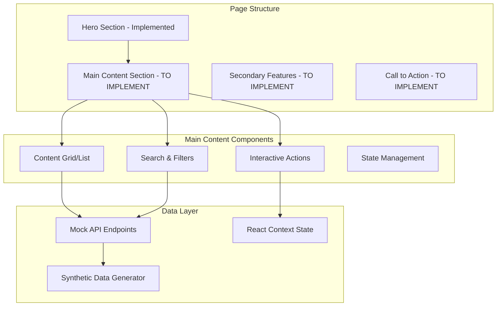

# Platform Content Completion Design

## Overview

This design document outlines the implementation approach for completing the MADMall platform content sections. The current platform has hero sections implemented but lacks the core functional content that makes each section usable and demonstrates the platform's value proposition.

The design focuses on creating engaging, culturally appropriate content sections with realistic synthetic data, interactive features, and seamless user experiences that showcase the complete digital wellness mall concept.

## Architecture

### Content Section Architecture



### Component Hierarchy

```typescript
// Page Component Structure
PageContent
├── HeroSection (existing)
├── MainContentSection (new)
│   ├── ContentGrid/List
│   ├── SearchAndFilters
│   ├── InteractiveActions
│   └── LoadingStates
├── SecondaryFeaturesSection (new)
└── CTASection (new)
```

## Components and Interfaces

### Concourse Homepage Components

#### Mall Navigation Grid
```typescript
interface MallSection {
  id: string;
  title: string;
  description: string;
  icon: string;
  href: string;
  memberCount?: number;
  activityLevel: 'low' | 'medium' | 'high';
  color: string;
}

const MallNavigationGrid: React.FC = () => {
  const sections: MallSection[] = [
    {
      id: 'peer-circles',
      title: 'Peer Circles',
      description: 'Connect with sisters who understand your journey',
      icon: '👥',
      href: '/circles',
      memberCount: 1247,
      activityLevel: 'high',
      color: 'sage-green'
    },
    // ... other sections
  ];
  
  return (
    <div className="mall-navigation-grid">
      {sections.map(section => (
        <MallSectionCard key={section.id} section={section} />
      ))}
    </div>
  );
};
```

#### Community Activity Feed
```typescript
interface ActivityItem {
  id: string;
  type: 'post' | 'join' | 'story' | 'relief_rating';
  user: {
    name: string;
    avatar: string;
  };
  content: string;
  timestamp: Date;
  engagement: {
    likes: number;
    comments: number;
  };
}

const CommunityActivityFeed: React.FC = () => {
  const [activities, setActivities] = useState<ActivityItem[]>([]);
  
  useEffect(() => {
    // Fetch recent community activities
    fetchCommunityActivities().then(setActivities);
  }, []);
  
  return (
    <div className="community-activity-feed">
      <h2>Community Pulse</h2>
      {activities.map(activity => (
        <ActivityCard key={activity.id} activity={activity} />
      ))}
    </div>
  );
};
```

### Peer Circles Components

#### Circle Discovery Grid
```typescript
interface Circle {
  id: string;
  name: string;
  description: string;
  memberCount: number;
  isPrivate: boolean;
  tags: string[];
  recentActivity: Date;
  moderators: string[];
  rules: string[];
}

const CircleDiscoveryGrid: React.FC = () => {
  const [circles, setCircles] = useState<Circle[]>([]);
  const [searchTerm, setSearchTerm] = useState('');
  const [selectedTags, setSelectedTags] = useState<string[]>([]);
  
  const filteredCircles = circles.filter(circle => 
    circle.name.toLowerCase().includes(searchTerm.toLowerCase()) &&
    (selectedTags.length === 0 || selectedTags.some(tag => circle.tags.includes(tag)))
  );
  
  return (
    <div className="circle-discovery">
      <SearchAndFilters 
        searchTerm={searchTerm}
        onSearchChange={setSearchTerm}
        selectedTags={selectedTags}
        onTagsChange={setSelectedTags}
      />
      <div className="circles-grid">
        {filteredCircles.map(circle => (
          <CircleCard key={circle.id} circle={circle} />
        ))}
      </div>
    </div>
  );
};
```

### Comedy Lounge Components

#### Video Content Library
```typescript
interface ComedyClip {
  id: string;
  title: string;
  description: string;
  thumbnailUrl: string;
  videoUrl: string;
  duration: number;
  category: string;
  tags: string[];
  averageReliefRating: number;
  viewCount: number;
  creator: {
    name: string;
    avatar: string;
  };
}

const VideoContentLibrary: React.FC = () => {
  const [clips, setClips] = useState<ComedyClip[]>([]);
  const [selectedCategory, setSelectedCategory] = useState<string>('all');
  
  const categories = [
    'Graves Giggles',
    'Sisterhood Laughs', 
    'Daily Dose',
    'Wellness Humor',
    'Community Favorites'
  ];
  
  return (
    <div className="video-content-library">
      <CategoryTabs 
        categories={categories}
        selected={selectedCategory}
        onSelect={setSelectedCategory}
      />
      <div className="video-grid">
        {clips.map(clip => (
          <VideoCard key={clip.id} clip={clip} />
        ))}
      </div>
    </div>
  );
};
```

#### Relief Rating System
```typescript
interface ReliefRating {
  clipId: string;
  userId: string;
  rating: number; // 1-5
  timestamp: Date;
  notes?: string;
}

const ReliefRatingPrompt: React.FC<{ clipId: string; onSubmit: (rating: ReliefRating) => void }> = ({ clipId, onSubmit }) => {
  const [rating, setRating] = useState<number>(0);
  const [notes, setNotes] = useState<string>('');
  
  const handleSubmit = () => {
    onSubmit({
      clipId,
      userId: 'current-user-id',
      rating,
      timestamp: new Date(),
      notes: notes.trim() || undefined
    });
  };
  
  return (
    <div className="relief-rating-prompt">
      <h3>How did this make you feel?</h3>
      <StarRating value={rating} onChange={setRating} />
      <textarea 
        placeholder="Share how this helped you (optional)"
        value={notes}
        onChange={(e) => setNotes(e.target.value)}
      />
      <button onClick={handleSubmit}>Submit Relief Rating</button>
    </div>
  );
};
```

### Marketplace Components

#### Product Grid with Business Stories
```typescript
interface Product {
  id: string;
  name: string;
  description: string;
  price: number;
  imageUrl: string;
  affiliateUrl: string;
  business: {
    name: string;
    ownerName: string;
    story: string;
    logoUrl: string;
    isBlackOwned: boolean;
  };
  category: string;
  tags: string[];
  rating: number;
  reviewCount: number;
}

const ProductGrid: React.FC = () => {
  const [products, setProducts] = useState<Product[]>([]);
  const [selectedCategory, setSelectedCategory] = useState<string>('all');
  const [wishlist, setWishlist] = useState<string[]>([]);
  
  const categories = [
    'Self-Care',
    'Wellness',
    'Beauty',
    'Nutrition',
    'Mental Health',
    'Fitness'
  ];
  
  const toggleWishlist = (productId: string) => {
    setWishlist(prev => 
      prev.includes(productId) 
        ? prev.filter(id => id !== productId)
        : [...prev, productId]
    );
  };
  
  return (
    <div className="product-grid">
      <CategoryFilters 
        categories={categories}
        selected={selectedCategory}
        onSelect={setSelectedCategory}
      />
      <div className="products-grid">
        {products.map(product => (
          <ProductCard 
            key={product.id} 
            product={product}
            isWishlisted={wishlist.includes(product.id)}
            onToggleWishlist={() => toggleWishlist(product.id)}
          />
        ))}
      </div>
    </div>
  );
};
```

### Resource Hub Components

#### Article Library with Search
```typescript
interface Article {
  id: string;
  title: string;
  excerpt: string;
  content: string;
  author: {
    name: string;
    credentials: string;
    avatar: string;
  };
  category: string;
  tags: string[];
  readingTime: number;
  publishedAt: Date;
  rating: number;
  bookmarkCount: number;
}

const ArticleLibrary: React.FC = () => {
  const [articles, setArticles] = useState<Article[]>([]);
  const [searchTerm, setSearchTerm] = useState('');
  const [selectedCategory, setSelectedCategory] = useState<string>('all');
  const [bookmarks, setBookmarks] = useState<string[]>([]);
  
  const categories = [
    'Graves Disease',
    'Mental Health',
    'Nutrition',
    'Exercise',
    'Self-Care',
    'Medical Advocacy'
  ];
  
  const filteredArticles = articles.filter(article => 
    (searchTerm === '' || article.title.toLowerCase().includes(searchTerm.toLowerCase()) ||
     article.excerpt.toLowerCase().includes(searchTerm.toLowerCase())) &&
    (selectedCategory === 'all' || article.category === selectedCategory)
  );
  
  return (
    <div className="article-library">
      <SearchBar 
        value={searchTerm}
        onChange={setSearchTerm}
        placeholder="Search wellness resources..."
      />
      <CategoryTabs 
        categories={['all', ...categories]}
        selected={selectedCategory}
        onSelect={setSelectedCategory}
      />
      <div className="articles-list">
        {filteredArticles.map(article => (
          <ArticleCard 
            key={article.id} 
            article={article}
            isBookmarked={bookmarks.includes(article.id)}
            onToggleBookmark={() => toggleBookmark(article.id)}
          />
        ))}
      </div>
    </div>
  );
};
```

### Story Booth Components

#### Story Creation Interface
```typescript
interface Story {
  id: string;
  title: string;
  content: string;
  type: 'text' | 'audio';
  audioUrl?: string;
  author: {
    name: string;
    avatar: string;
  };
  tags: string[];
  publishedAt: Date;
  engagement: {
    likes: number;
    comments: number;
    shares: number;
  };
  isAnonymous: boolean;
}

const StoryCreationInterface: React.FC = () => {
  const [storyType, setStoryType] = useState<'text' | 'audio'>('text');
  const [title, setTitle] = useState('');
  const [content, setContent] = useState('');
  const [tags, setTags] = useState<string[]>([]);
  const [isAnonymous, setIsAnonymous] = useState(false);
  
  const handleSubmit = async () => {
    const story: Omit<Story, 'id' | 'publishedAt' | 'engagement'> = {
      title,
      content,
      type: storyType,
      author: {
        name: isAnonymous ? 'Anonymous Sister' : 'Current User',
        avatar: isAnonymous ? '/default-avatar.png' : '/user-avatar.png'
      },
      tags,
      isAnonymous
    };
    
    await createStory(story);
    // Reset form and redirect
  };
  
  return (
    <div className="story-creation">
      <div className="story-type-selector">
        <button 
          className={storyType === 'text' ? 'active' : ''}
          onClick={() => setStoryType('text')}
        >
          📝 Text Story
        </button>
        <button 
          className={storyType === 'audio' ? 'active' : ''}
          onClick={() => setStoryType('audio')}
        >
          🎤 Audio Story
        </button>
      </div>
      
      <input 
        type="text"
        placeholder="Story title..."
        value={title}
        onChange={(e) => setTitle(e.target.value)}
      />
      
      {storyType === 'text' ? (
        <RichTextEditor 
          value={content}
          onChange={setContent}
          placeholder="Share your story..."
        />
      ) : (
        <AudioRecorder 
          onRecordingComplete={(audioUrl) => setContent(audioUrl)}
        />
      )}
      
      <TagSelector 
        selectedTags={tags}
        onTagsChange={setTags}
      />
      
      <label>
        <input 
          type="checkbox"
          checked={isAnonymous}
          onChange={(e) => setIsAnonymous(e.target.checked)}
        />
        Share anonymously
      </label>
      
      <button onClick={handleSubmit}>Publish Story</button>
    </div>
  );
};
```

## Data Models

### Mock API Endpoints

```typescript
// API endpoint structure
const API_ENDPOINTS = {
  // Concourse
  '/api/mall-sections': 'GET - Mall navigation sections',
  '/api/community-activity': 'GET - Recent community activity',
  '/api/platform-stats': 'GET - Platform statistics',
  
  // Peer Circles
  '/api/circles': 'GET - All circles with filters',
  '/api/circles/:id': 'GET - Circle details',
  '/api/circles/:id/join': 'POST - Join circle',
  '/api/circles/:id/posts': 'GET - Circle posts',
  '/api/circles/:id/posts': 'POST - Create post',
  
  // Comedy Lounge
  '/api/comedy/clips': 'GET - Comedy clips with filters',
  '/api/comedy/clips/:id': 'GET - Clip details',
  '/api/comedy/relief-ratings': 'POST - Submit relief rating',
  '/api/comedy/categories': 'GET - Content categories',
  
  // Marketplace
  '/api/marketplace/products': 'GET - Products with filters',
  '/api/marketplace/products/:id': 'GET - Product details',
  '/api/marketplace/wishlist': 'GET/POST/DELETE - Wishlist management',
  '/api/marketplace/categories': 'GET - Product categories',
  
  // Resource Hub
  '/api/resources/articles': 'GET - Articles with search/filters',
  '/api/resources/articles/:id': 'GET - Article details',
  '/api/resources/bookmarks': 'GET/POST/DELETE - Bookmark management',
  '/api/resources/categories': 'GET - Article categories',
  
  // Story Booth
  '/api/stories': 'GET/POST - Stories list and creation',
  '/api/stories/:id': 'GET - Story details',
  '/api/stories/:id/comments': 'GET/POST - Story comments',
  '/api/stories/tags': 'GET - Available tags'
};
```

### Synthetic Data Generation

```typescript
// Data generation utilities
const generateSyntheticData = {
  users: (count: number) => Array.from({ length: count }, generateUser),
  circles: (count: number) => Array.from({ length: count }, generateCircle),
  comedyClips: (count: number) => Array.from({ length: count }, generateComedyClip),
  products: (count: number) => Array.from({ length: count }, generateProduct),
  articles: (count: number) => Array.from({ length: count }, generateArticle),
  stories: (count: number) => Array.from({ length: count }, generateStory)
};

const generateUser = (): User => ({
  id: `user-${Math.random().toString(36).substr(2, 9)}`,
  name: faker.name.fullName(),
  avatar: `https://api.dicebear.com/7.x/avataaars/svg?seed=${Math.random()}`,
  joinedAt: faker.date.past(2),
  location: faker.address.city(),
  interests: faker.helpers.arrayElements([
    'Graves Disease Support', 'Mental Health', 'Wellness', 'Self-Care',
    'Nutrition', 'Exercise', 'Community', 'Sisterhood'
  ], 3)
});
```

## Testing Strategy

### Component Testing
```typescript
// Example test for MallNavigationGrid
describe('MallNavigationGrid', () => {
  it('should display all mall sections', () => {
    render(<MallNavigationGrid />);
    
    expect(screen.getByText('Peer Circles')).toBeInTheDocument();
    expect(screen.getByText('Comedy Lounge')).toBeInTheDocument();
    expect(screen.getByText('Marketplace')).toBeInTheDocument();
    expect(screen.getByText('Resource Hub')).toBeInTheDocument();
    expect(screen.getByText('Story Booth')).toBeInTheDocument();
  });
  
  it('should navigate to section when card is clicked', async () => {
    const user = userEvent.setup();
    render(<MallNavigationGrid />);
    
    await user.click(screen.getByText('Peer Circles'));
    
    expect(mockNavigate).toHaveBeenCalledWith('/circles');
  });
});
```

### Integration Testing
```typescript
// Example integration test
describe('Peer Circles Integration', () => {
  it('should allow user to join circle and create post', async () => {
    const user = userEvent.setup();
    render(<PeerCirclesContent />);
    
    // Join a circle
    await user.click(screen.getByText('Join Circle'));
    expect(screen.getByText('Joined')).toBeInTheDocument();
    
    // Create a post
    await user.type(screen.getByPlaceholderText('Share with the community...'), 'Hello everyone!');
    await user.click(screen.getByText('Post'));
    
    expect(screen.getByText('Hello everyone!')).toBeInTheDocument();
  });
});
```

## Performance Considerations

### Lazy Loading
```typescript
// Implement lazy loading for content sections
const LazyVideoGrid = lazy(() => import('./VideoGrid'));
const LazyProductGrid = lazy(() => import('./ProductGrid'));

// Use Suspense for loading states
<Suspense fallback={<ContentSkeleton />}>
  <LazyVideoGrid />
</Suspense>
```

### Virtual Scrolling
```typescript
// For large lists (comedy clips, products, articles)
import { FixedSizeList as List } from 'react-window';

const VirtualizedProductGrid: React.FC<{ products: Product[] }> = ({ products }) => (
  <List
    height={600}
    itemCount={products.length}
    itemSize={300}
    itemData={products}
  >
    {({ index, style, data }) => (
      <div style={style}>
        <ProductCard product={data[index]} />
      </div>
    )}
  </List>
);
```

### Caching Strategy
```typescript
// Implement React Query for data caching
const useCircles = () => {
  return useQuery({
    queryKey: ['circles'],
    queryFn: fetchCircles,
    staleTime: 5 * 60 * 1000, // 5 minutes
    cacheTime: 10 * 60 * 1000, // 10 minutes
  });
};
```

This design provides a comprehensive approach to completing the platform content sections with realistic functionality, engaging user experiences, and maintainable code architecture.