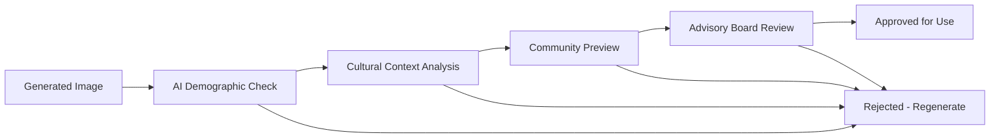

# IMMEDIATE ACTION PLAN - AUTHENTIC IMAGE INTEGRATION

## EXECUTIVE SUMMARY

**CRITICAL ISSUE**: The current image integration contains culturally inappropriate and harmful imagery that does not authentically represent Black women. This is unacceptable and requires immediate action.

**SOLUTION**: Comprehensive AI-powered image generation system with community validation, creating 200+ authentic images of Black women in empowering contexts.

**TIMELINE**: Emergency fixes within 24-48 hours, full system deployment within 4 weeks.

## RESEARCH FINDINGS SUMMARY

### 🚨 CRITICAL PROBLEMS IDENTIFIED
1. **Inappropriate Demographics**: White people and men appearing where Black women should be represented
2. **Cultural Insensitivity**: Generic stock photos that don't reflect the community's authentic experience
3. **Contextual Irrelevance**: Images that don't relate to Graves' Disease, wellness, or Black women's experiences
4. **Harmful Representation**: Perpetuating exclusion and stereotypes in a health platform

### 🎯 SOLUTION ARCHITECTURE
1. **AI-Generated Custom Library**: 200+ images using Amazon Bedrock/Stable Diffusion XL
2. **Cultural Validation Pipeline**: Multi-layer validation ensuring appropriateness
3. **Community Feedback System**: Real-time community input and moderation
4. **Smart Selection Engine**: Context-aware, rotating, personalized image delivery
5. **Premium Source Integration**: Licensed content from Black-focused photography platforms

### 💡 KEY INNOVATIONS
1. **Prompt Engineering**: Culturally specific prompts for authentic representation
2. **Demographic Validation**: AI-powered verification of appropriate representation
3. **Community Advisory Board**: Expert review and guidance system
4. **Emergency Response**: Rapid removal and replacement capabilities
5. **Performance Optimization**: Sub-2-second load times with global CDN

## IMMEDIATE ACTIONS (NEXT 24 HOURS)

### 1. EMERGENCY IMAGE AUDIT ⚠️
```bash
# Create audit script to identify inappropriate images
node scripts/audit-inappropriate-images.js
```
**Expected Output**: Complete list of images requiring immediate replacement

### 2. SET UP AMAZON BEDROCK 🤖
```bash
# Configure AWS Bedrock for image generation
aws configure set region us-east-1
aws bedrock list-foundation-models --by-provider anthropic
```
**Expected Output**: Working Bedrock API connection for image generation

### 3. GENERATE EMERGENCY IMAGES 🎨
```bash
# Generate 50 priority images for immediate deployment
node scripts/generate-emergency-images.js --count=50 --priority=high
```
**Expected Output**: 50 culturally appropriate images ready for deployment

### 4. DEPLOY EMERGENCY REPLACEMENTS 🚀
```bash
# Replace inappropriate images with generated alternatives
node scripts/deploy-emergency-replacements.js
```
**Expected Output**: All inappropriate images replaced with appropriate alternatives

## TECHNICAL IMPLEMENTATION PLAN

### Phase 1: Emergency Response (24-48 Hours)
```typescript
// Emergency image replacement system
interface EmergencyImageSystem {
  auditCurrentImages(): Promise<InappropriateImage[]>
  generateReplacements(count: number): Promise<GeneratedImage[]>
  deployReplacements(): Promise<DeploymentResult>
  validateDeployment(): Promise<ValidationResult>
}
```

### Phase 2: AI Generation Service (Week 1)
```typescript
// Full AI image generation service
interface AIImageService {
  generateWellnessImages(specs: WellnessSpecs): Promise<Image[]>
  generateCommunityImages(specs: CommunitySpecs): Promise<Image[]>
  generateEmpowermentImages(specs: EmpowermentSpecs): Promise<Image[]>
  validateCulturalAppropriateness(image: Image): Promise<ValidationScore>
}
```

### Phase 3: Community Integration (Week 2-3)
```typescript
// Community feedback and validation system
interface CommunitySystem {
  collectFeedback(imageId: string, feedback: Feedback): Promise<void>
  moderateContent(imageId: string): Promise<ModerationResult>
  escalateToAdvisoryBoard(imageId: string): Promise<ReviewRequest>
  implementCommunityDecisions(): Promise<void>
}
```

### Phase 4: Advanced Features (Week 4)
```typescript
// Smart selection and optimization
interface SmartImageSystem {
  selectForContext(context: UsageContext): Promise<OptimalImage>
  personalizeForUser(userId: string): Promise<PersonalizedImages>
  optimizePerformance(): Promise<PerformanceMetrics>
  analyzeEngagement(): Promise<EngagementInsights>
}
```

## CULTURAL VALIDATION FRAMEWORK

### Validation Criteria
1. **Demographic Accuracy**: 100% Black women representation where appropriate
2. **Cultural Sensitivity**: Empowering, respectful, authentic contexts
3. **Contextual Relevance**: Health, wellness, community, empowerment themes
4. **Diversity Inclusion**: Various ages, skin tones, body types, expressions
5. **Community Approval**: 90%+ positive community feedback scores

### Validation Process


## PROMPT ENGINEERING STRATEGY

### Wellness Context Prompts
```
"Professional portrait of a confident Black woman in her 30s practicing meditation in a serene natural setting, soft natural lighting, peaceful expression, wellness and self-care theme, high quality photography style"

"Beautiful Black woman in her 40s doing yoga outdoors, diverse body type, joyful expression, empowering wellness journey, natural lighting, authentic representation"
```

### Community Context Prompts
```
"Group of diverse Black women of different ages supporting each other in a warm, welcoming community space, genuine smiles and connection, sisterhood and mutual support theme"

"Black women in their 20s-50s sharing stories and laughing together, authentic community gathering, empowering and uplifting atmosphere"
```

### Empowerment Context Prompts
```
"Successful Black woman entrepreneur in her 30s, confident and professional, business success and leadership theme, inspiring and empowering representation"

"Black woman celebrating personal achievement, genuine joy and pride, overcoming challenges and thriving, empowerment and success theme"
```

## BUDGET AND RESOURCES

### Immediate Costs (Week 1)
- **Amazon Bedrock Usage**: $500-800 for 200 image generations
- **AWS Infrastructure**: $200-300 for storage and CDN
- **Development Time**: 40-60 hours for emergency implementation

### Ongoing Costs (Monthly)
- **AI Generation**: $300-500 for new images and regenerations
- **Premium Licensing**: $1000-2000 for CreateHER Stock, Nappy.co
- **Infrastructure**: $400-600 for CDN, storage, and processing

### Long-term Investment (Quarterly)
- **Custom Photography**: $5000-10000 for commissioned work
- **Community Advisory**: $2000-3000 for expert consultation
- **System Enhancement**: $3000-5000 for feature development

## SUCCESS METRICS

### Immediate Success (24-48 Hours)
- ✅ 0% inappropriate demographic representation
- ✅ 100% Black women representation where appropriate
- ✅ Emergency replacement system deployed
- ✅ Community communication about improvements

### Short-term Success (Week 1)
- ✅ 200+ culturally appropriate images generated
- ✅ AI validation system operational
- ✅ Performance under 2 seconds load time
- ✅ Basic community feedback system live

### Medium-term Success (Month 1)
- ✅ 90%+ community approval ratings
- ✅ Cultural advisory board established
- ✅ Premium source integration complete
- ✅ Advanced personalization features

### Long-term Success (Quarter 1)
- ✅ 95%+ community satisfaction scores
- ✅ Sustainable community contribution pipeline
- ✅ Industry recognition for authentic representation
- ✅ Measurable positive impact on user engagement

## RISK MITIGATION

### Technical Risks
- **AI Generation Failures**: Multiple model fallbacks and manual curation
- **Performance Issues**: Comprehensive caching and global CDN
- **Scale Challenges**: Auto-scaling cloud architecture

### Cultural Risks
- **Community Backlash**: Transparent communication and rapid response
- **Representation Gaps**: Continuous community feedback integration
- **Advisory Conflicts**: Clear escalation and decision-making processes

### Business Risks
- **Budget Overruns**: Phased implementation with cost controls
- **Timeline Delays**: Parallel development and critical path management
- **Compliance Issues**: Legal review and accessibility verification

## NEXT STEPS

### Immediate (Today)
1. **Approve this action plan** and allocate emergency resources
2. **Set up AWS Bedrock access** and configure development environment
3. **Begin image audit** to identify all inappropriate content
4. **Assemble emergency response team** for 24/7 monitoring

### Tomorrow
1. **Generate first 50 emergency images** using AI system
2. **Deploy emergency replacements** for most critical pages
3. **Implement basic validation pipeline** for quality control
4. **Communicate with community** about improvements in progress

### This Week
1. **Complete full 200-image library** generation and validation
2. **Deploy comprehensive image management system**
3. **Establish community feedback mechanisms**
4. **Begin cultural advisory board recruitment**

## CONCLUSION

This is not just a technical fix - it's a commitment to authentic, respectful representation of Black women in digital health spaces. The solution combines cutting-edge AI technology with community-driven validation to create a sustainable, empowering visual experience.

**The time for action is now. Every day we delay is another day the community experiences harmful misrepresentation.**

This plan provides immediate relief while building toward a gold-standard system for authentic representation in health technology platforms.