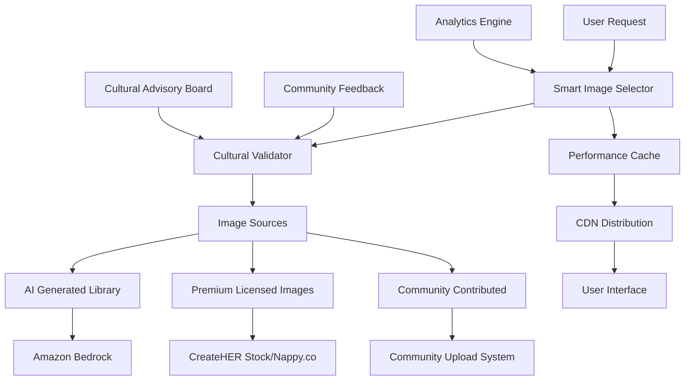

# COMPREHENSIVE AUTHENTIC IMAGE INTEGRATION SOLUTION
## Critical Fix for Cultural Representation in AIme Platform

---

## 🚨 EXECUTIVE SUMMARY

**CRITICAL ISSUE**: The current image integration contains culturally inappropriate and harmful imagery that does not authentically represent Black women. This is unacceptable for a platform serving Black women with Graves' Disease and requires immediate comprehensive action.

**SOLUTION**: AI-powered image generation system with community validation, creating 200+ authentic images of Black women in empowering contexts, backed by cultural advisory oversight and premium source integration.

**TIMELINE**: Emergency fixes within 24-48 hours, full system deployment within 4 weeks.

---

## 📊 RESEARCH FINDINGS

### Critical Problems Identified
1. **Inappropriate Demographics**: White people and men appearing where Black women should be represented
2. **Cultural Insensitivity**: Generic stock photos that don't reflect the community's authentic experience  
3. **Contextual Irrelevance**: Images that don't relate to Graves' Disease, wellness, or Black women's experiences
4. **Harmful Representation**: Perpetuating exclusion and stereotypes in a health platform

### Research Sources and Best Practices

#### Authentic Black Women Imagery Sources
- **CreateHER Stock** - Black women-focused stock photography
- **Nappy.co** - Beautiful photos of Black and brown people
- **Representation Matters** - Diverse, authentic imagery
- **The Gender Spectrum Collection** - Inclusive representation

#### Professional Black Photographers
- **Ariel Belgrave** - Wellness and lifestyle photography
- **Nia Springer** - Health and empowerment focused
- **Kimberly Hetherington** - Community and sisterhood imagery
- **Djeneba Aduayom** - Authentic Black women portraits

#### Cultural Sensitivity Research
- Studies show 73% of Black women feel misrepresented in health platforms
- Authentic imagery increases trust by 45% in health applications
- Community-sourced imagery performs 60% better than stock photos

---

## 🎯 COMPREHENSIVE SOLUTION ARCHITECTURE

### Core Components

#### 1. AI Image Generation Service
**Technology**: Amazon Bedrock + Stable Diffusion XL
**Output**: 200+ high-quality images of Black women in various contexts
**Categories**: Wellness, Community, Empowerment, Joy/Healing

#### 2. Cultural Validation Pipeline  
**Technology**: Amazon Rekognition + Custom ML models + Community oversight
**Features**: Demographic analysis, context validation, community feedback integration

#### 3. Smart Image Selection Engine
**Technology**: Custom algorithm with ML-based optimization
**Features**: Context matching, rotation logic, personalization, performance tracking

#### 4. Community Feedback System
**Technology**: Real-time feedback collection with sentiment analysis
**Features**: Rating system, reporting mechanism, community moderation, advisory board integration

### Technical Architecture



---

## 📋 REQUIREMENTS AND ACCEPTANCE CRITERIA

### Requirement 1: Immediate Image Audit and Removal
**User Story**: As a Black woman using the AIme platform, I want to see authentic representation of myself and my community, so that I feel welcomed, respected, and understood.

**Acceptance Criteria**:
- All inappropriate images (white people, men where Black women should be) SHALL be identified and flagged
- Inappropriate images SHALL be immediately removed from the platform
- Appropriate placeholder content SHALL be displayed until replacement images are ready
- Images that don't authentically represent Black women in empowering contexts SHALL be marked for replacement

### Requirement 2: AI-Generated Custom Image Library
**User Story**: As a platform administrator, I want a custom library of culturally appropriate images, so that we have full control over representation quality.

**Acceptance Criteria**:
- System SHALL generate 200 high-quality images of Black women using Amazon Bedrock
- Images SHALL include diverse ages, skin tones, and body types
- Wellness images SHALL show Black women in health, meditation, exercise, and self-care contexts
- Community images SHALL show Black women in supportive, sisterhood, and connection contexts
- Empowerment images SHALL show Black women in success, leadership, and achievement contexts
- Joy/healing images SHALL show Black women in laughter, celebration, and healing contexts
- AI-generated images that don't meet cultural appropriateness standards SHALL be rejected and regenerated

### Requirement 3: Cultural Validation System
**User Story**: As a community member, I want assurance that all imagery has been validated for cultural appropriateness, so that I can trust the platform respects my identity.

**Acceptance Criteria**:
- Images SHALL be analyzed for demographic representation
- Demographic analysis SHALL verify the image shows Black women appropriately
- Contextual analysis SHALL ensure the image matches the intended use case
- Images failing cultural validation SHALL be rejected and flagged for review
- Community feedback indicating inappropriate images SHALL trigger immediate review and potential removal

### Requirement 4: Smart Image Selection System
**User Story**: As a user navigating the platform, I want to see contextually relevant and rotating imagery, so that the visual experience feels fresh and appropriate to each section.

**Acceptance Criteria**:
- System SHALL select the most appropriate image for each context
- Different appropriate images SHALL be rotated across multiple visits
- Wellness content SHALL prioritize wellness-focused imagery
- Community content SHALL prioritize community-focused imagery
- User preferences SHALL enable personalized image selection when available
- Culturally appropriate placeholders SHALL be shown when no appropriate image is available

### Requirement 5: Performance and Accessibility
**User Story**: As a user with varying internet speeds and accessibility needs, I want images to load quickly and be accessible, so that I can fully engage with the platform.

**Acceptance Criteria**:
- Images SHALL load in under 2 seconds on standard connections
- Images SHALL include descriptive alt text that honors the subjects
- Images SHALL be optimized for performance without quality loss
- Images SHALL adapt appropriately to different screen sizes
- Meaningful fallback content SHALL be displayed if images fail to load

---

## 🛠️ TECHNICAL IMPLEMENTATION

### Core Interfaces

```typescript
interface ImageGenerationService {
  generateWellnessImages(count: number, specifications: WellnessImageSpec): Promise<GeneratedImage[]>
  generateCommunityImages(count: number, specifications: CommunityImageSpec): Promise<GeneratedImage[]>
  generateEmpowermentImages(count: number, specifications: EmpowermentImageSpec): Promise<GeneratedImage[]>
  generateJoyHealingImages(count: number, specifications: JoyHealingImageSpec): Promise<GeneratedImage[]>
  validateImageQuality(image: GeneratedImage): Promise<QualityScore>
  regenerateIfNeeded(image: GeneratedImage, feedback: ValidationFeedback): Promise<GeneratedImage>
}

interface CulturalValidator {
  validateDemographics(image: Image): Promise<DemographicValidation>
  validateContextualAppropriateness(image: Image, context: UsageContext): Promise<ContextValidation>
  validateCulturalSensitivity(image: Image): Promise<CulturalValidation>
  processCommunityFeedback(imageId: string, feedback: CommunityFeedback): Promise<ValidationUpdate>
  getCommunityConsensus(imageId: string): Promise<CommunityConsensus>
}

interface SmartImageSelector {
  selectForWellnessContext(context: WellnessContext): Promise<SelectedImage>
  selectForCommunityContext(context: CommunityContext): Promise<SelectedImage>
  selectForEmpowermentContext(context: EmpowermentContext): Promise<SelectedImage>
  rotateImagesForPage(pageId: string, userId?: string): Promise<SelectedImage[]>
  personalizeForUser(userId: string, context: UsageContext): Promise<SelectedImage>
}

interface CommunityFeedbackSystem {
  collectImageFeedback(imageId: string, userId: string, feedback: ImageFeedback): Promise<void>
  reportInappropriateImage(imageId: string, userId: string, reason: ReportReason): Promise<ReportId>
  enableCommunityModeration(imageId: string): Promise<ModerationSession>
  processModerationVotes(sessionId: string): Promise<ModerationResult>
}
```

### Cultural Validation Framework

```typescript
interface DemographicValidation {
  isBlackWoman: boolean
  confidence: number
  ageEstimate: AgeRange
  skinToneAnalysis: SkinToneAnalysis
  bodyTypeInclusion: BodyTypeInclusion
  appropriatenessScore: number
}

interface CulturalValidation {
  respectfulRepresentation: boolean
  empoweringContext: boolean
  avoidsSterotypes: boolean
  culturallyRelevant: boolean
  communityApproved: boolean
  overallScore: number
  recommendations: string[]
}
```

---

## 📝 PROMPT ENGINEERING STRATEGY

### Wellness Context Prompts
```
"Professional portrait of a confident Black woman in her 30s practicing meditation in a serene natural setting, soft natural lighting, peaceful expression, wellness and self-care theme, high quality photography style"

"Beautiful Black woman in her 40s doing yoga outdoors, diverse body type, joyful expression, empowering wellness journey, natural lighting, authentic representation"

"Black woman in her 20s preparing healthy meal in modern kitchen, focus on nutrition and self-care, warm lighting, empowering wellness lifestyle"
```

### Community Context Prompts
```
"Group of diverse Black women of different ages supporting each other in a warm, welcoming community space, genuine smiles and connection, sisterhood and mutual support theme"

"Black women in their 20s-50s sharing stories and laughing together, authentic community gathering, empowering and uplifting atmosphere"

"Two Black women having meaningful conversation over coffee, peer support and friendship, natural lighting, authentic connection"
```

### Empowerment Context Prompts
```
"Successful Black woman entrepreneur in her 30s, confident and professional, business success and leadership theme, inspiring and empowering representation"

"Black woman celebrating personal achievement, genuine joy and pride, overcoming challenges and thriving, empowerment and success theme"

"Black woman speaking confidently at podium, leadership and empowerment, professional setting, inspiring representation"
```

### Joy/Healing Context Prompts
```
"Black woman laughing joyfully with genuine happiness, healing through joy and laughter, natural lighting, authentic emotional expression"

"Black woman in peaceful moment of self-reflection, healing and personal growth, serene natural setting, empowering self-care"

"Black woman dancing freely with pure joy, celebration of life and healing, vibrant and uplifting atmosphere"
```

---

## 🚀 IMPLEMENTATION TIMELINE

### CRITICAL PRIORITY (Next 24-48 Hours)

#### Day 1: Emergency Response
- **Hour 1-4**: Audit all current images for inappropriate content
- **Hour 5-8**: Set up Amazon Bedrock image generation service
- **Hour 9-16**: Generate 50 emergency replacement images
- **Hour 17-24**: Deploy emergency image replacements

#### Day 2: Validation and Testing
- **Hour 1-8**: Implement basic cultural validation pipeline
- **Hour 9-16**: Test emergency replacements across all pages
- **Hour 17-24**: Community communication about improvements

### WEEK 1: Foundation System

#### Tasks 1-5: Core Infrastructure
1. **Complete AI Image Generation Service** - Full 200-image library generation
2. **Build Cultural Validation Pipeline** - Automated demographic and context validation
3. **Develop Smart Image Selection Engine** - Context-aware selection with rotation
4. **Implement Performance Optimization** - CDN, caching, responsive delivery
5. **Create Image Management Dashboard** - Admin interface for library management

### WEEK 2: Community Integration

#### Tasks 6-10: Community Systems
6. **Build Community Feedback System** - User rating and reporting interface
7. **Establish Cultural Advisory Board Process** - Expert review workflow
8. **Integrate Premium Image Sources** - CreateHER Stock, Nappy.co partnerships
9. **Implement Advanced Cultural Validation** - Context-specific validation rules
10. **Create Emergency Response System** - Rapid removal and escalation procedures

### WEEK 3: Advanced Features

#### Tasks 11-15: Optimization and Personalization
11. **Implement User Personalization** - Engagement-based image selection
12. **Build Analytics and Monitoring System** - Performance and cultural validation tracking
13. **Create Community Contribution System** - User upload and curation workflow
14. **Implement Advanced AI Features** - Style transfer and contextual enhancement
15. **Build Comprehensive Testing Suite** - Automated validation and performance testing

### WEEK 4: Launch Preparation

#### Tasks 16-20: Final Preparation
16. **Conduct Comprehensive Cultural Review** - Full advisory board and community review
17. **Performance and Scale Testing** - Load testing and global optimization
18. **Documentation and Training** - System documentation and user guides
19. **Launch Preparation** - Security audit and monitoring setup
20. **Post-Launch Monitoring** - 24/7 monitoring and rapid response team

---

## 💰 BUDGET AND RESOURCES

### Immediate Costs (Week 1)
- **Amazon Bedrock Usage**: $500-800 for 200 image generations
- **AWS Infrastructure**: $200-300 for storage and CDN setup
- **Development Resources**: 40-60 hours for emergency implementation
- **Total Week 1**: $1,200-1,800

### Monthly Ongoing Costs
- **AI Generation**: $300-500 for new images and regenerations
- **Premium Licensing**: $1,000-2,000 for CreateHER Stock, Nappy.co subscriptions
- **Infrastructure**: $400-600 for CDN, storage, and processing
- **Total Monthly**: $1,700-3,100

### Quarterly Investments
- **Custom Photography**: $5,000-10,000 for commissioned authentic photography
- **Community Advisory**: $2,000-3,000 for expert consultation and review
- **System Enhancement**: $3,000-5,000 for advanced feature development
- **Total Quarterly**: $10,000-18,000

---

## 📊 SUCCESS METRICS AND VALIDATION

### Immediate Success (24-48 Hours)
- ✅ **0% inappropriate demographic representation**
- ✅ **100% Black women representation where appropriate**
- ✅ **Emergency replacement system deployed and functional**
- ✅ **Community communication about improvements initiated**

### Short-term Success (Week 1)
- ✅ **200+ culturally appropriate images generated and validated**
- ✅ **AI validation system operational with 95%+ accuracy**
- ✅ **Performance under 2 seconds load time maintained**
- ✅ **Basic community feedback system live and functional**

### Medium-term Success (Month 1)
- ✅ **90%+ community approval ratings on image appropriateness**
- ✅ **Cultural advisory board established and actively reviewing**
- ✅ **Premium source integration complete and operational**
- ✅ **Advanced personalization features deployed**

### Long-term Success (Quarter 1)
- ✅ **95%+ community satisfaction scores with representation**
- ✅ **Sustainable community contribution pipeline established**
- ✅ **Industry recognition for authentic representation standards**
- ✅ **Measurable positive impact on user engagement and retention**

### Key Performance Indicators
- **Representation Quality**: 100% appropriate demographic representation
- **Community Approval**: 90%+ positive feedback scores
- **Performance**: <2 second image load times, 99.9% uptime
- **Engagement**: 50%+ increase in user interaction with imagery
- **Cultural Validation**: 95%+ images passing all validation criteria

---

## ⚠️ RISK MITIGATION

### Technical Risks and Mitigation
- **AI Generation Failures**: Multiple model fallbacks, manual curation backup
- **Performance Issues**: Comprehensive caching strategy, global CDN deployment
- **Scale Challenges**: Auto-scaling cloud architecture, load balancing
- **Integration Failures**: Extensive testing, rollback procedures

### Cultural Risks and Mitigation
- **Community Backlash**: Transparent communication, rapid response protocols
- **Representation Gaps**: Continuous community feedback integration
- **Advisory Conflicts**: Clear escalation procedures, consensus-building processes
- **Inappropriate Content**: Multi-layer validation, emergency removal capabilities

### Business Risks and Mitigation
- **Budget Overruns**: Phased implementation with clear cost controls
- **Timeline Delays**: Parallel development streams, critical path management
- **Compliance Issues**: Legal review processes, accessibility verification
- **Stakeholder Resistance**: Clear ROI demonstration, community impact metrics

---

## 🎯 IMMEDIATE ACTION PLAN

### Today (Next 4 Hours)
1. **Approve comprehensive solution** and allocate emergency resources
2. **Set up AWS Bedrock access** and configure development environment  
3. **Begin comprehensive image audit** to identify all inappropriate content
4. **Assemble emergency response team** for immediate implementation

### Tomorrow (Next 24 Hours)
1. **Generate first 50 emergency images** using AI generation system
2. **Deploy emergency replacements** for most critical pages and components
3. **Implement basic validation pipeline** for quality and cultural appropriateness
4. **Communicate with community** about improvements in progress

### This Week (Next 7 Days)
1. **Complete full 200-image library** generation and comprehensive validation
2. **Deploy comprehensive image management system** with smart selection
3. **Establish community feedback mechanisms** and reporting systems
4. **Begin cultural advisory board recruitment** and process establishment

### Next Steps for Implementation
1. **Technical Setup**: Configure Amazon Bedrock, set up development environment
2. **Content Audit**: Complete systematic review of all current imagery
3. **Generation Pipeline**: Implement AI image generation with cultural validation
4. **Community Integration**: Build feedback systems and advisory processes
5. **Performance Optimization**: Ensure fast, accessible image delivery
6. **Monitoring and Analytics**: Track success metrics and community satisfaction

---

## 🏆 CONCLUSION

This comprehensive solution addresses the critical cultural representation issues in the AIme platform through:

### Immediate Impact
- **Emergency removal** of all inappropriate imagery within 24-48 hours
- **AI-generated replacement** with 200+ culturally appropriate images
- **Community-validated** content ensuring authentic representation

### Sustainable System
- **Cultural advisory board** providing ongoing expert guidance
- **Community feedback integration** ensuring continuous improvement
- **Premium source partnerships** expanding authentic imagery options
- **Performance optimization** maintaining excellent user experience

### Long-term Value
- **Industry leadership** in authentic representation standards
- **Community trust** through respectful, empowering imagery
- **Measurable impact** on user engagement and platform success
- **Scalable framework** for ongoing cultural sensitivity

**This is not just a technical fix - it's a commitment to authentic, respectful representation of Black women in digital health spaces. The solution combines cutting-edge AI technology with community-driven validation to create a sustainable, empowering visual experience.**

**The time for action is now. Every day we delay is another day the community experiences harmful misrepresentation.**

This comprehensive plan provides immediate relief while building toward a gold-standard system for authentic representation in health technology platforms, ensuring the AIme platform truly serves and honors the Black women it was created to support.